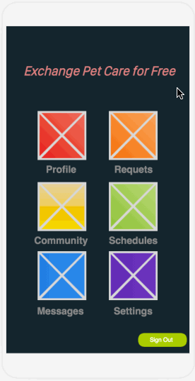
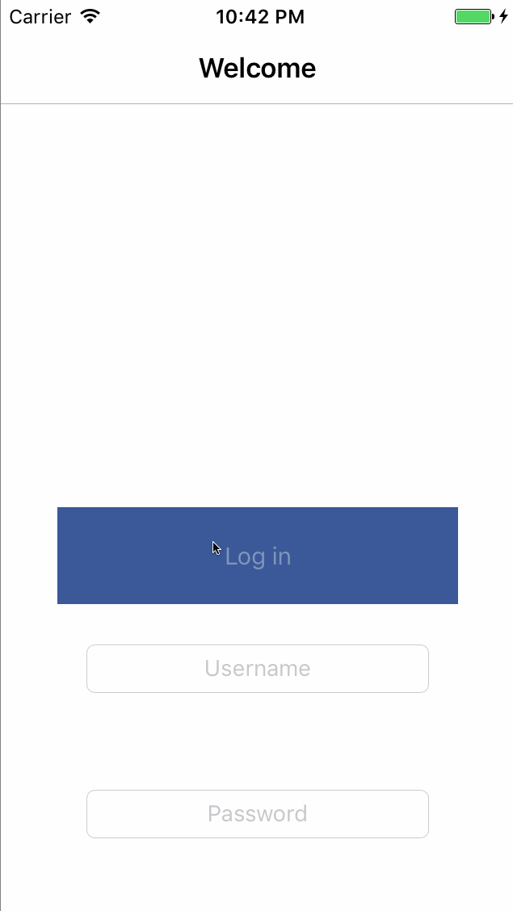

# PetPal
Pet care exchange for free among people you trust most.

# Definitions:

#### Community: A group of trusted individuals comprising of friends, family and neighbors.
#### Messages: Any communication between two users mainly of two types:
            - Requests: Group Requests, Care Requests
            - DM: Chat feature betweern users
#### Schedule: The collection of upcoming Pet Care requested for or past Pet Care provided.

# User Stories

The following base functionality is provided with the free version of this application:

- [ ] User can sign up with Twitter, Facebook, Google or E-mail.
- [x] A Launch Screen that will display the story of the App upon first launch

##### Communities Features
- [x] User can send and recieve requests for pet care among their community.
- [x] User can look for communities based on thier geo-location.
- [x] User can create, join and leave communities within the app.

##### Backend and Specifics
- [x] User can see requests, messages and other data that is retreieved from a Parse DB using Parse API.
- [ ] User sees an error message when there is a network error.
- [x] Application will save the login credentials of the user until logout.

##### Profile
- [x] User can edit his/her own profile page. .
- [x] User will be able to view other user's profile pages.
- [ ] User will be able to scroll through a Home Feed of posts by users within their community.
- [ ] User can post pictures to profile or other users via Direct Message.

##### Messages
- [ ] User will recieve notifications for requests/messages while the app is running in the background.
- [x] User will be able to view other user's profile pages.
- [x] User will be able to start a private conversation from his/her contact list.
- [x] Users will be able to see their conversation lively on the chatting board.
- [x] Message will show a timestamp of its last updated time.
- [x] New message will change its count status upon it's viewing status.

##### Schedule
- [x] Users can view their upcoming schedules.

<!--- 
Walkthrough of all user stories:

Sprint1 walk through

Sprint2 walk through

Sprint3 walk through

--->

Video walkthrough

# License

    Copyright 2017 PetPal

    Licensed under the Apache License, Version 2.0 (the "License");
    you may not use this file except in compliance with the License.
    You may obtain a copy of the License at

        http://www.apache.org/licenses/LICENSE-2.0

    Unless required by applicable law or agreed to in writing, software
    distributed under the License is distributed on an "AS IS" BASIS,
    WITHOUT WARRANTIES OR CONDITIONS OF ANY KIND, either express or implied.
    See the License for the specific language governing permissions and
    limitations under the License.
